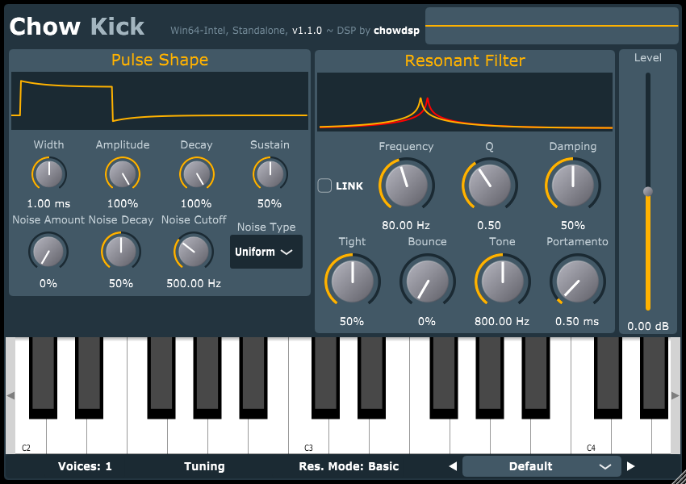

# ChowKick


[](https://opensource.org/licenses/BSD-3-Clause)

**ChowKick is currently in pre-release. If you would like
to try the pre-release builds, please see the [nightly
builds page](https://chowdsp.com/nightly.html).**

**ChowKick** is a kick drum synthesizer plugin based on 
creative modelling of old-school drum machine circuits.
MIDI input to the plugin triggers a pulse with a
parameterized size and shape. The pulse is then passed
into a resonant filter which can be tuned to a specific
frequency, or matched to the frequency of the incoming
MIDI notes.



## Building

To build from scratch, you must have CMake installed.

```bash
# Clone the repository
$ git clone https://github.com/Chowdhury-DSP/ChowKick.git
$ cd ChowKick

# initialize and set up submodules
$ git submodule update --init --recursive

# build with CMake
$ cmake -Bbuild
$ cmake --build build --config Release
```
The resulting builds can be found in `build/ChowKick_artefacts`.

## Credits

- GUI Framework - [Plugin GUI Magic](https://github.com/ffAudio/PluginGUIMagic)
- SIMD functions - [XSIMD](https://github.com/xtensor-stack/xsimd)

This plugin was inspired by Kurt Werner's analysis and
modelling of the TR-808 Kick Drum Circuit, discussed
in his wonderful [PhD Dissertation](https://stacks.stanford.edu/file/druid:jy057cz8322/KurtJamesWernerDissertation-augmented.pdf).

## License

ChowKick is open source, and is licensed under the BSD 3-clause license.
Enjoy!
